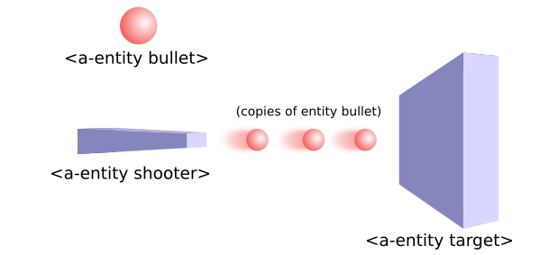

# aframe-super-shooter

Simple Shooter Kit for [A-Frame](https://aframe.io).

This is a set of components and systems (under a single file) to provide a way of building simple shooting experiences, where a "shooter" shoots "bullets" that can hit "targets".



* One entity bullet defines the look of all the instances of itself that are going to be shot.
* Shooter defines the source position and orientation of the bullets.
* Collisions among bullet's and target's bounding boxes are checked. 

So you just define which entities are bullets, targets and shooters, and manage the logic among them using events:

Shooter:
* *Emit* an event `shot` on a shooter to make it shoot
* *Emit* an event `changebullet` on a shooter to change active bullet

Target:
* *Listen* to event `hit` on a target to know when it was hit by a bullet
* *Listen* to event `die` on a target to know when its life was finished


## API

### Shooter component

| Property | Description | Default Value |
| -------- | ----------- | ------------- |
| bullets  | array of bullets (their names) that this shooter can use |    ['normal']     |
| useBullet  | current bullet used   | 'normal'        |
| cycle         | when changing to next or prev bullet type, cycle to the first or last (resp.) type when reaching the last/first (resp.)          |  false             |

### Bullet component

| Property | Description | Default Value |
| -------- | ----------- | ------------- |
| name  | Name of this bullet type |  'normal'    |
| life  | Life that gets from targets when hit |  1.0    |
| speed  | In m/s aprox. | 1.0     |
| maxTime  | When this time (in seconds) is elapsed, the bullet dissapears. |  1.0    |
| cacheSize  | How many copies of this bullet can be on screen at the same time |  10    |

### Target component

| Property | Description | Default Value |
| -------- | ----------- | ------------- |
| static | This object moves or changes shape. If static==false, bounding box is recalculated continuously | true |
| life | Internal life of target. Each time a bullet hits it, this life is reduced by bullet's life, and when it gets <= 0 the event 'die' is emmited to the target | 0 |
| active | Whether this target is included in collision tests. | true |

## Examples

* [Example gallery](https://supermedium.github.io/aframe-super-shooter/)
* [Supercraft shooter](https://supermedium.github.io/supercraft-shooter/)

## Installation

### Browser

Install and use by directly including the [browser files](dist):

```html
<head>
  <script src="https://aframe.io/releases/0.8.0/aframe.min.js"></script>
  <script src="aframe-shooter-component.min.js"></script>
</head>

<body>
  <a-scene>
    <a-entity bullet geometry="primitive: sphere"></a-entity>
    <a-entity target geometry="primitive: box"></a-entity>
    <a-entity shooter id="gun" geometry="primitive: box></a-entity>
  </a-scene>

  <script>
    document.body.addEventListener('mousedown', function(){
      document.getElementById('gun').emit('shoot');
    });
  </script>
</body>
```

### npm

Install via npm:

```bash
npm install aframe-super-shooter
```

Then require and use.

```js
require('aframe');
require('aframe-super-shooter');
```
